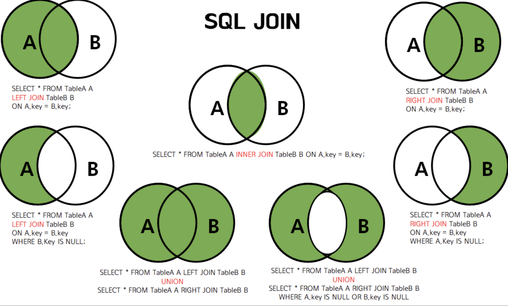

# MySQL
### 피드백
- AS 변수명 붙이는 느낌.
- group by
  - 조건 붙일 때는 where이 아니라 having
  - 칼럼을 두 개 넣을 수도 있음. (이 두 가지가 같은 걸 기준으로 ~~해줘.)
- ! 별칭을 사용할 때 기억해야 할 주의사항 ! 
  - 테이블 별칭은 WHERE 절에서 사용 가능
  - 열(칼럼) 별칭은 WHERE 절에서 사용 불가능 (단, GROUP BY나 ORDER BY 같은 절에는 별칭 사용 가능)
    - SELECT절보다 WHERE 절이 먼저 실행되기 때문
  - select에서 연속적으로 별칭을 이용할 순 없는 듯.
- WHERE COLUMN LIKE '' 특정 문자 있는지 확인
- 문자열 합치기 CONCAT(STR1, STR2, ...)

### JOIN
- 
- TABLE1 JOIN TABLE2 ON 조건
- LEFT OUTER JOIN
  - 첫 번째 테이블을 기준으로 두 번째 테이블을 조합
  - 첫 번째 테이블은 모두 검색되어야 함.
  ```SQL
  -- 예) 1학년 학생의 이름과 지도교수명을 출력하라. 단, 지도교수가 지정되지 않은 학생도 출력되게 하라.

  SELECT STUDENT.NAME, PROFESSOR.NAME 
  FROM STUDENT LEFT OUTER JOIN PROFESSOR -- STUDENT를 기준으로 왼쪽 조인
  ON STUDENT.PID = PROFESSOR.ID 
  WHERE GRADE = 1
  ```
- RIGHT OUTER JOIN
  - 두 번째 테이블을 기준으로 첫 번째 테이블을 조합
  - 두 번째 테이블이 모두 검색되어야 함.
  ```SQL
  -- 예) 1학년 학생의 이름과 지도교수명을 출력하라. 단, 지도교수가 지정되지 않은 학생도 출력되게 하라.

  SELECT STUDENT.NAME, PROFESSOR.NAME 
  FROM STUDENT RIGHT OUTER JOIN PROFESSOR -- PROFESSOR를 기준으로 오른쪽 조인
  ON STUDENT.PID = PROFESSOR.ID 
  WHERE GRADE = 1
  ```

### IN
- 집합 내부에 값이 존재하는지 여부를 확인합니다. (값 자체가 있는지 정확히 판단 %(x))
- COLUM IN ('ABC') -> ture or false
- 서브 쿼리 이용: COLUMN IN (SELECT ~~) 
- (a.user, a.group) IN ('test2', 'B')

### IF
- IF(조건문, 참일 때 값, 거짓일 때 값)
- IFNULL(column_name, '대체할 값')
- CASE WHEN
  ```sql
  SELECT
	CASE
		WHEN permission_type_id = 1
		THEN '관리자'
		WHEN permission_type_id = 2
		THEN '판매자'
		ELSE '일반 유저'
  END	
  ```

### A BETWEEN B AND C (날짜, 숫자 등 비교)

### DATE
- DATE_FORMAT(date, format)
- DATEDIFF(D1, D2) -- D1 - D2를 반환함. 몇일동안 이루어졌는지 알고싶으면 +1해야함.

### 문자열 가져오기
- SUBSTRING(STR, STARTIDX, COUNT) -- MID와 동일
- LEFT(STR, COUNT)
- RIGHT(STR, COUNT)

- IN 정확히

### NULL
- ISNULL()
- ~ IS NULL
- ~ IS NOT NULL

### NUMBER
- ROUND(N) : 반올림
- ROUND(N, 2) : 소수점 둘째자리 까지
  

### LIMIT
- 행 데이터 10개만 조회하기
  - SELECT title, content, writer FROM board LIMIT 10;
- 11번째 ~ 20번째 행 데이터 조회
  - SELECT title, content, writer FROM board LIMIT 10, 10;